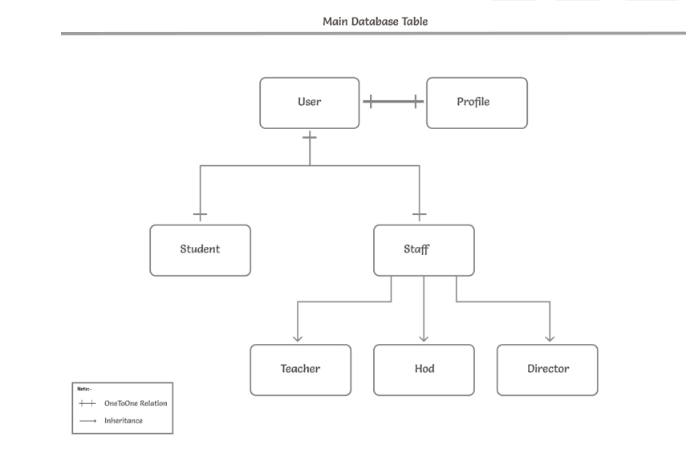
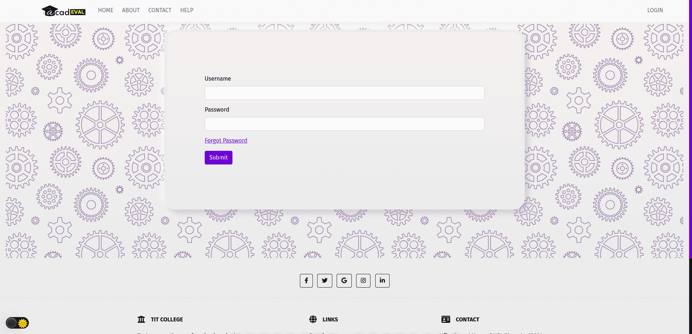
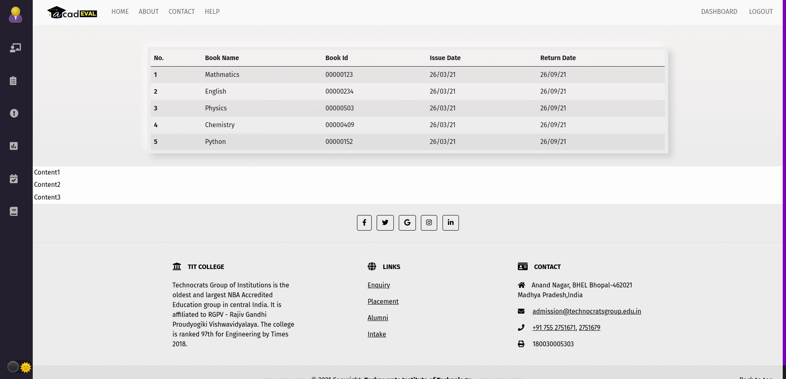
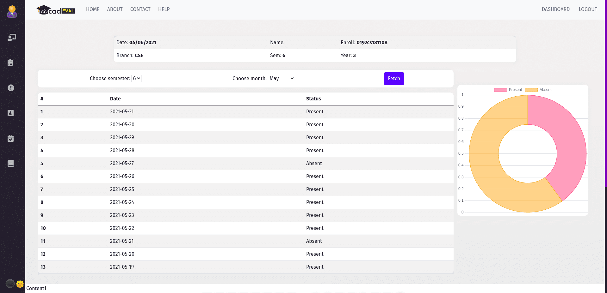
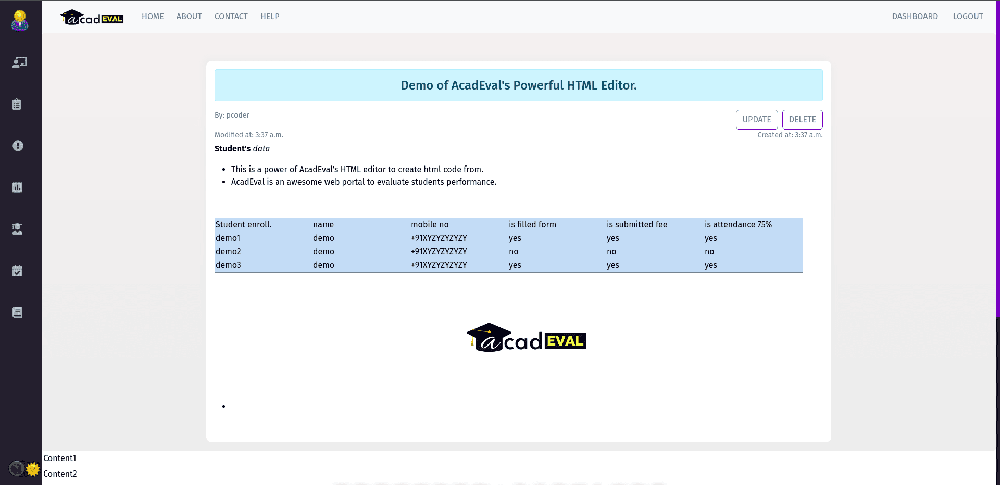
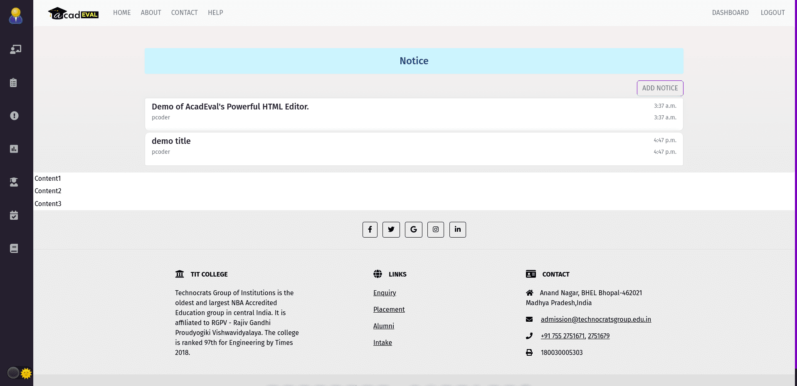
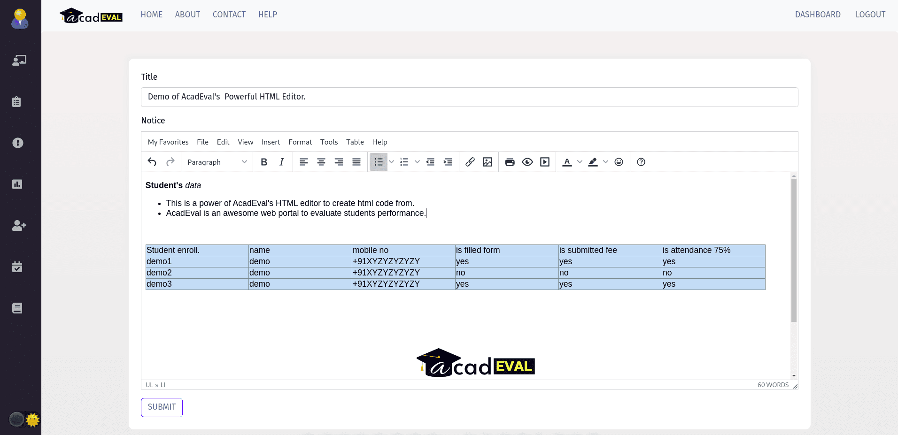
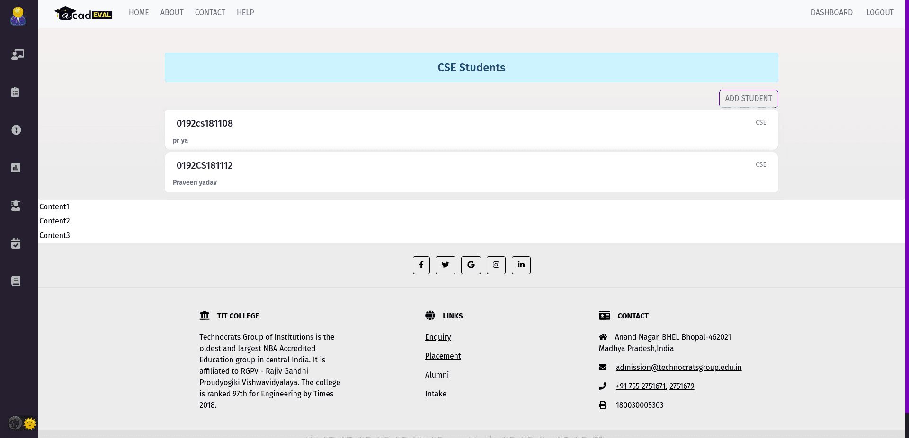
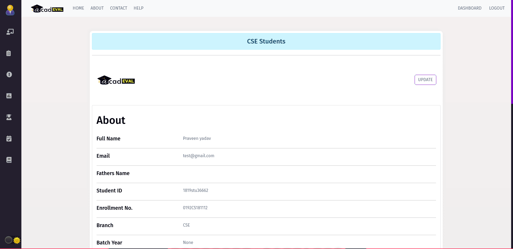
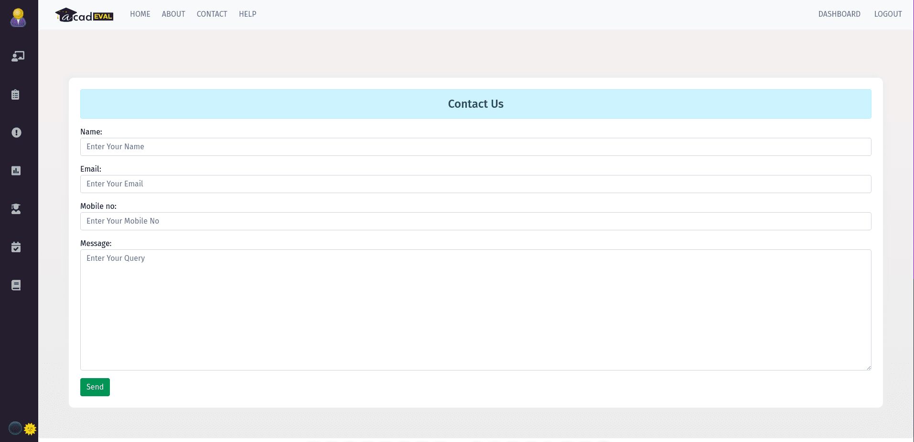

# acadEval-preview

Students’ academic performance is evaluated by their performance in exams conducted by the institutes or Universities. This system evaluate students academic performance by considering several factors. In this method, we consider three parameters attendance, internal marks and external marks which are considered to evaluate students final academic performance.

## Motivation

The motivation for doing this project was primarily an interest in undertaking a challenging project in an interesting area of research. The opportunity to learn about a new area of computing not covered in lectures.
We came up with the idea of this project in view of this Universal pandemic (COVID-19).

## Features

1. Evaluation of Academic Performance
2. Prediction of future performance
3. Displaying marks (internal and external)
4. Displaying attendance
5. Notices
6. Information about events and seminars
7. Class schedule

## Software/Tools
1. Python
2. Django
3. SQLite3
4. Visual Studio Code
5. Browser(Any)

## Packages 
1. Rest_framework
2. Django-import-export,
3. Pillow
4. python-dotenv

## Main Database Tables
1. USER	
2. PROFILE	
3. STUDENT	
4. STAFF	
5. TEACHER	
6. HOD	
7. DIRECTOR

# Screens
## Login Page

## Library

## Student attendance Page - with Graph

## Note page

## Notice page

## Create Notice Page - HTML Editor

## Student list Page

## Profile Page

## Contact Page

## Team
